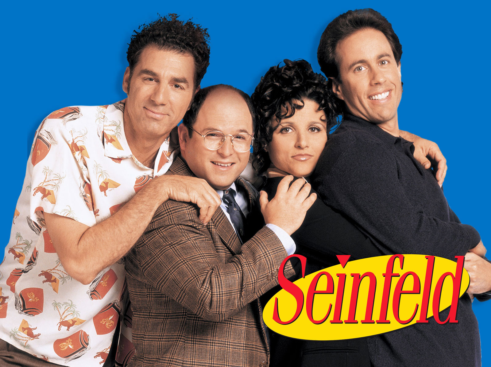

# Seinfeld Script Generation using LSTM (Reccurent Neural Networks).

This repository contains step by step code for generation of __Text that resemble Seinfeld Script Writings__.



Here is a sample of a possible text generation created by this model:

```bash
hoyt: you know, this is the recipe.

hoyt: you know what? ma. i knew this was fairly inappropriate.

hoyt: so, essentially, i guess i was employed articulate.

estelle: so, um, the hardest thing she could do this?

estelle: i told you, you have a decent record of cheese, and now you cannot deduct the bakery?

[new witness: delivery room from a holster

[new larry: oh, hi.

[new larry: ma, this was a lovely decision. it's modeled- parking commitment.

[new witness: dr. wilcox, dated marla, wet, autumn and four weeks ago, and greed, and greed. i banned it up.

estelle: so, what did you do?

estelle: what?

estelle: oh, hi boys!

estelle: i was aware, uh?

frank: i don't know, um, i guess we should be able to create the hint on thursday avenue!

estelle: i don't think you could.

helen: i told you what the library interest contact.

estelle: no, i can't believe this.

estelle: oh yeah, that's right.

helen: i can't do that.

estelle: what?

estelle: i can't believe you can communicate.

hoyt: you can't tell me what i think.

estelle: i don't want to be able to attend to the beach. you know, i was just wondering if you could just get a record.

estelle:(whistles) i wonder, i got a regular decision

```


The architecture of the model exists as the following:

1. Embedding Layer
2. LSTM Layer
3. Fully Connected Linear Layer
4. Cross Entropy Activation

The output maps to a word in a preestablished dictionary, from the [Seinfeld Dataset.](https://www.kaggle.com/thec03u5/seinfeld-chronicles#scripts.csv)

## Long Short Term Memory Networks( LSTMs)
With the discovery of Recurrent Neural Networks(RNNs) , a whole new dimension was added to the study of Deep Learning. The dimension of Time. With RNNs aur models upgraded from images to videos, time stationary signals to voices, etc.
But earlier model of RNNs suffered from a major problem with Gradients. As the model backpropogates through time gradients either vanished or exploded depending wether the max gradient value was less than one or larger than one.
LSTMs try to solve this problem using 4 gates.

Basic Structure of LSTM is as follows


__These gates are :__
- Input Gate(Sigmoid) : Controls wether to write a cell or not.
- Forget Gate(Sigmoid) : Controls Wether to erase data on the cell or not.
- Output Gate(Sigmoid) : Controls how much to reveal the cell for update.
- Gate Gate(Tanh) : Controls the write value of cell.

Here I use LSTMs to generate text.

Final Model Hyperparameters and Results:

```python

Final: Loss: 3.214442391236623 (Dropout Layer Removed)
    
    Epochs: 12
    
    Sequence_Length: 10
    
    N_layers: 2
    
    embedding_dim = 256
    
    hidden_dim = 256
    
    lr = 0.002

```

Models were trained using PyTorch

